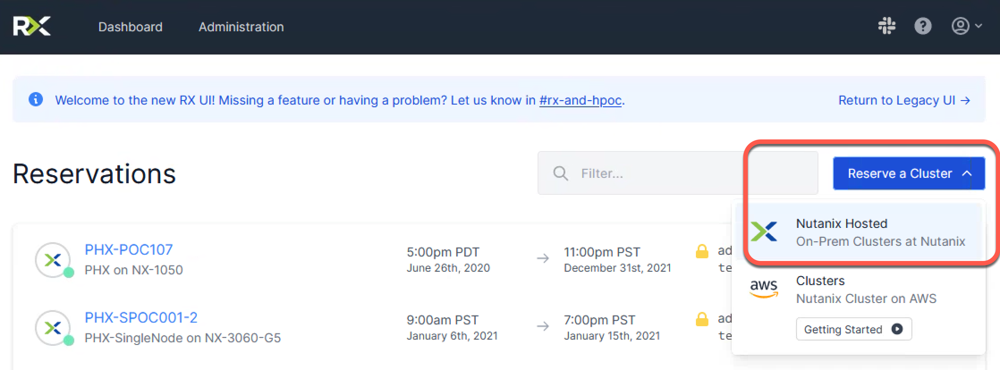
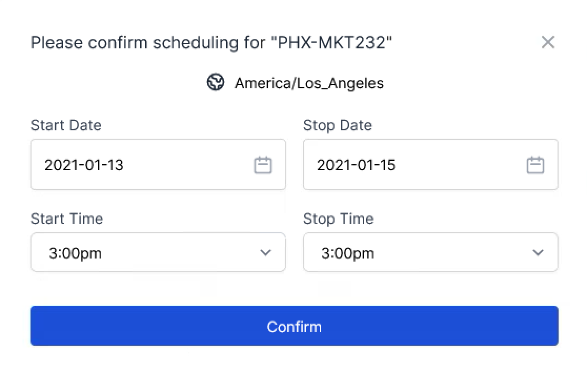
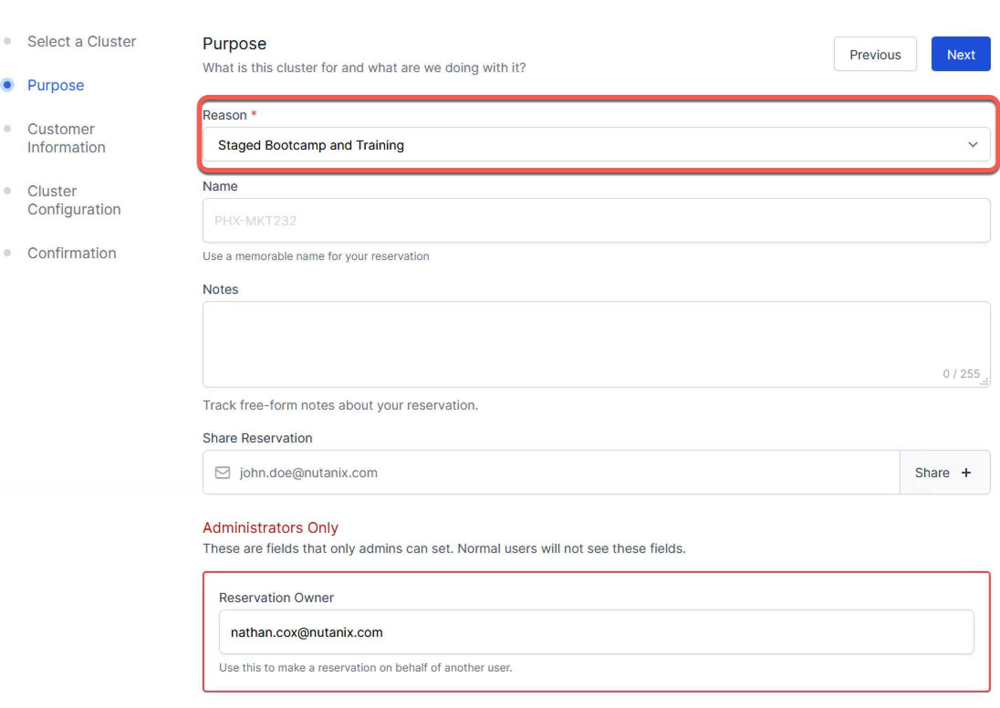
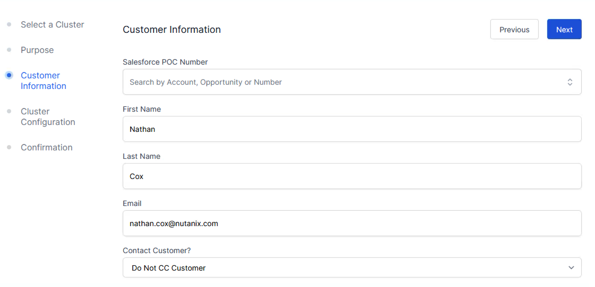
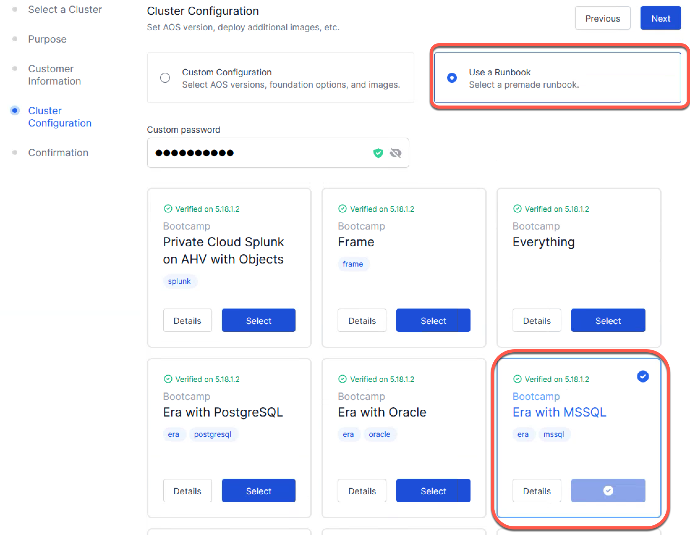

.. _se_reserve:

------------------------
Reserving A HPOC Cluster
------------------------

When reserving a cluster for your Bootcamp, ensure you are creating the reservation using the correct Hypervisor and AOS version.

- Click **Reserve a Cluster** > **Nutanix Hosted**

.. note::

    If this is for an Era Bootcamp, make sure to use and **All Flash** Cluster.

- Specify "From" and "To" dates: 2 days total (day before and day of bootcamp).
- Select the appropriate Data Center in the dropdown
- Click **Confirm**

- for **Select Reason** choose **Staged Bootcamp and Training**. (enter any other relevant information in the Notes field).
- Share reservation: enter the SE's email address so that they get access to the reservation too and is able to make any changes as needed. (NOTE: Ensure you click the **Share +** character after entering the SE email in the form field)
- Click on **Next** to get to the next screen.

- Enter your name and Email on the **Customer Information** Screen
- Click on **Next** to get to the next screen.

- Select **Use a Runbook**
- Leave custom password field blank or enter a custom password if desired.

.. note::

  Warning: if entering a custom passwords note that all passwords get stored in clear text in a database so don't use any real passwords).

- **Select** the Runbook for the Bootcamp you are running.
- Click on **Next** to get to the next screen.

- Click **Confirm** to complete the reservation.

If you are unsure which versions to select for a specific template, reach out in either `#technology-bootcamps <slack://channel?id=C0RAC0CHX&team=T0252CLM8>`_ or `#hands-on-workshops <slack://channel?id=C8WLPRTB3&team=T0252CLM8>`_ on Slack.
